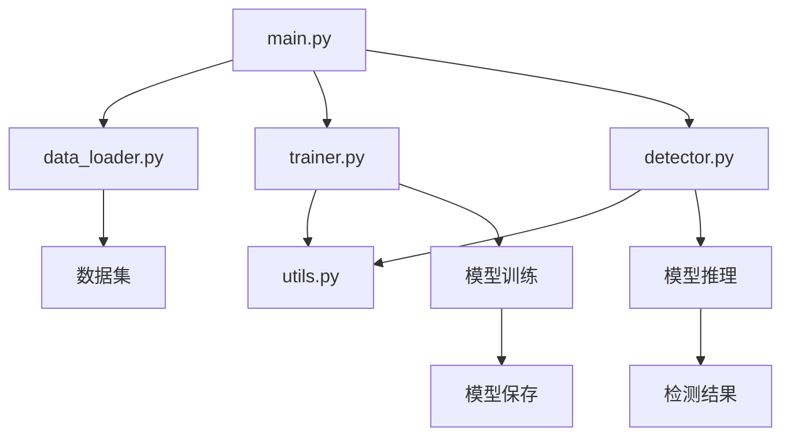

# YOLOv8 多场景目标检测项目

## 项目介绍

基于 YOLOv8 + PyTorch 开发的一体化目标检测项目，支持「人脸检测」「车牌识别」「自定义数据集训练」等多场景应用。

## 技术栈

- Python 3.8+
- PyTorch 2.0+
- Ultralytics YOLOv8
- OpenCV
- NumPy
- Matplotlib
- Pandas
- scikit-learn

## 项目结构

```
├── data_loader.py      # 数据加载模块
├── trainer.py          # 训练模块
├── detector.py         # 推理模块
├── utils.py            # 工具函数
├── main.py             # 主入口
├── README.md           # 项目说明文档
├── LICENSE             # MIT许可证
├── .gitignore          # Git忽略文件
└── requirements.txt    # 依赖包列表
```

## 功能特性

- **数据模块**：支持 VOC/COCO 格式数据集加载，提供人脸/车牌公开数据集下载指引
- **训练模块**：封装 YOLOv8 训练函数，支持自定义参数，保存最佳模型
- **推理模块**：支持图片/视频/摄像头实时检测，输出检测框和置信度
- **可视化模块**：绘制检测框、生成训练损失曲线、混淆矩阵
- **示例模块**：提供完整的运行示例

## 安装步骤

1. 克隆项目

2. 安装依赖
   ```bash
   pip install -r requirements.txt
   ```

3. 下载预训练模型（可选）
   - YOLOv8 预训练模型会在首次运行时自动下载

## 运行示例

### 人脸检测
```bash
python main.py --task face --source path/to/image.jpg
```

### 车牌识别
```bash
python main.py --task license --source path/to/image.jpg
```

### 自定义数据集训练
```bash
python main.py --task train --data path/to/data.yaml --epochs 100 --batch-size 16
```

## 数据集准备

### 人脸数据集
- [WIDER FACE](http://shuoyang1213.me/WIDERFACE/)
- [COCO Dataset](https://cocodataset.org/)

### 车牌数据集
- [CCPD (Chinese City Parking Dataset)](https://github.com/detectRecog/CCPD)
- [OpenALPR](https://github.com/openalpr/openalpr)

### 自定义数据集
1. 按照 YOLO 格式标注数据
2. 创建 data.yaml 配置文件
3. 运行训练命令

## 训练参数说明

- `--epochs`：训练轮数，默认 100
- `--batch-size`：批量大小，默认 16
- `--learning-rate`：学习率，默认 0.01
- `--img-size`：输入图片尺寸，默认 640
- `--device`：训练设备，默认自动选择（GPU优先）

## 效果展示

### 人脸检测效果


### 车牌识别效果


### 训练损失曲线


## 项目架构



## 注意事项

1. 确保 PyTorch 版本 ≥ 2.0
2. 训练时建议使用 GPU 以提高速度
3. 自定义数据集需要按照 YOLO 格式进行标注
4. 推理时可通过 `--conf` 参数调整置信度阈值

## 许可证

MIT License

## 贡献

欢迎提交 Issue 和 Pull Request 来改进这个项目！